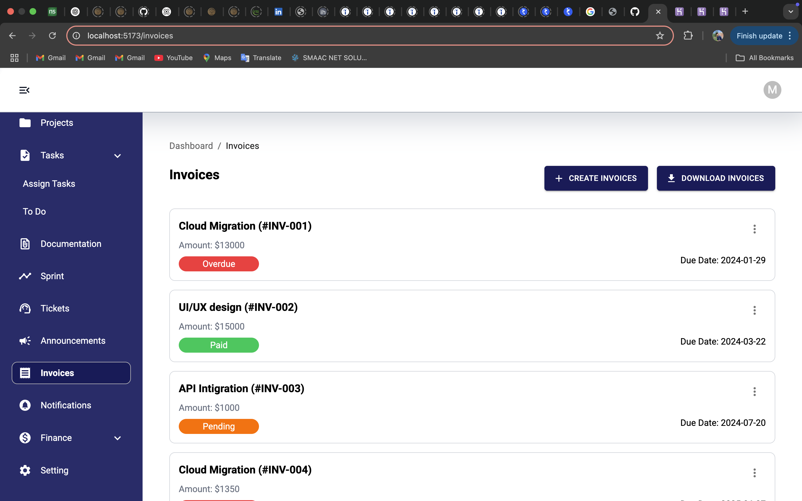
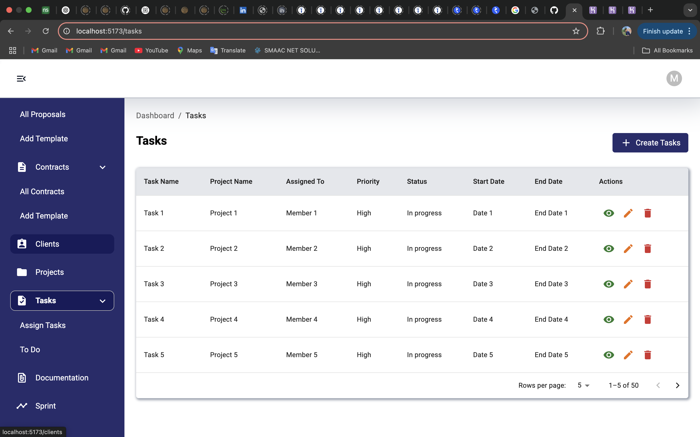
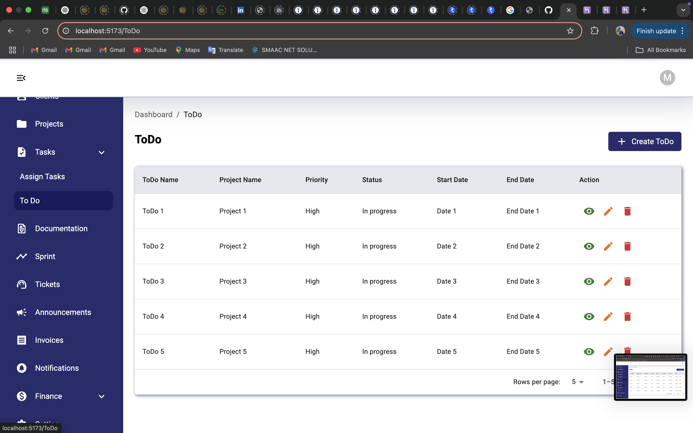
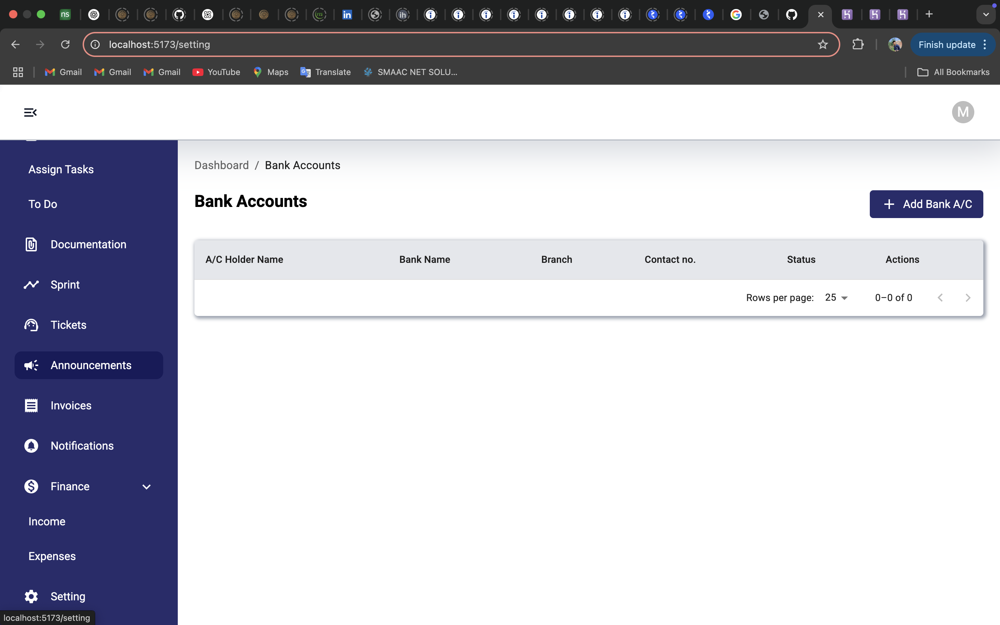
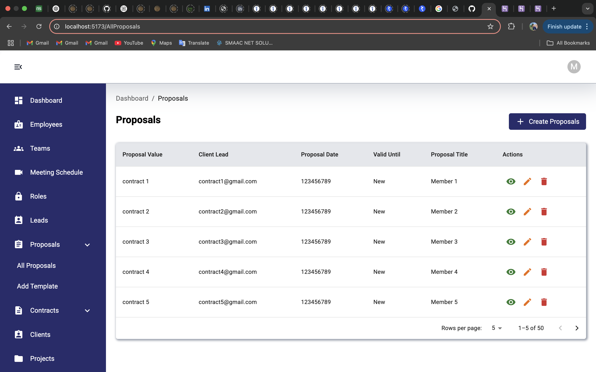

# Employee Management System – Frontend (React)

A modern, responsive frontend for the Employee Management System, built with React and Vite. This application provides an intuitive interface for managing employees, projects, tasks, finances, and more.

---

## Table of Contents
- [Overview](#overview)
- [Features](#features)
- [Screenshots](#screenshots)
- [Getting Started](#getting-started)
- [Project Structure](#project-structure)
- [Usage](#usage)
- [License](#license)

---

## Overview
This frontend is designed to work seamlessly with the Django backend, offering:
- A dashboard for HR, managers, and employees
- Easy navigation for all management modules
- Clean, professional UI/UX

---

## Features
- Dashboard with quick access to all modules
- Employee, team, and project management
- Task assignment and tracking
- Invoices and finance management
- Meeting scheduling and notifications
- Announcements and documentation
- Responsive design for desktop and tablet

---

## Screenshots

### Invoices


### Tasks


### ToDo


### Bank Accounts


### Proposals


*Replace the above image filenames with the actual names if different (e.g., lisa.png, logo.png, etc.). Place your screenshots in the `public/` directory.*

---

## Getting Started

1. **Clone the repository:**
   ```sh
   git clone <your-repo-url>
   cd Project_Management_Django-main
   ```
2. **Install dependencies:**
   ```sh
   npm install
   ```
3. **Run the development server:**
   ```sh
   npm run dev
   ```
   The app will be available at `http://localhost:5173` by default.
4. **Build for production:**
   ```sh
   npm run build
   ```
   The production build will be in the `dist/` folder.

---

## Project Structure
```
Project_Management_Django-main/
├── public/           # Static assets (screenshots, images, etc.)
├── src/              # React source code
│   ├── components/   # Reusable UI components
│   ├── pages/        # Main app pages (Dashboard, Employees, Tasks, etc.)
│   └── ...
├── App.jsx           # Main app entry
├── package.json      # Project dependencies
└── ...
```

---

## Usage
- Use the sidebar to navigate between modules (Employees, Projects, Tasks, Invoices, etc.)
- Create, edit, and manage records with intuitive forms and tables
- View status indicators (e.g., Paid, Overdue, Pending) for invoices and tasks
- Responsive design ensures usability on various devices

---

## License
This project is for educational and demonstration purposes. Please check with the author for production/commercial use.